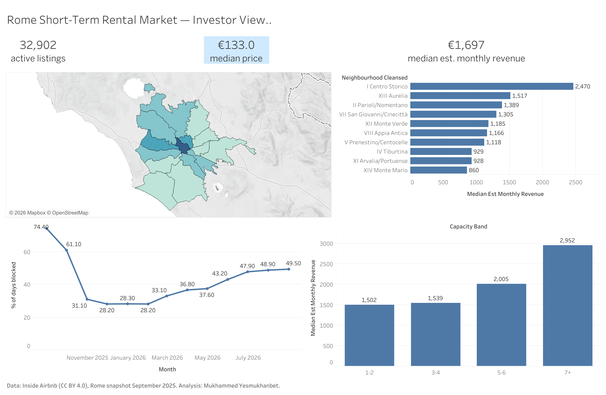

# Rome Short-Term Rental Market Analysis

**Where should a property-management company enter Rome's Airbnb market, with what type of property, and how should it price across the year?**

Market-entry analysis of 32,902 active Airbnb listings in Rome (Inside Airbnb snapshot, 14 September 2025), built on a PostgreSQL pipeline processing 13.7M calendar rows and 2.2M reviews.

**[Interactive dashboard on Tableau Public]https://public.tableau.com/views/RomeShort-TermRentalMarketAnalysis/Dashboard1?:language=en-US&:sid=&:redirect=auth&:display_count=n&:origin=viz_share_link**



---

## Business context

A property-management company is evaluating entry into Rome's short-term rental market. This analysis answers four questions an investor would actually ask:

1. **Where** — which districts offer the best revenue potential relative to competition?
2. **What** — which property configuration (room type, guest capacity) maximizes revenue?
3. **When / how to price** — what does the forward booking curve imply for pricing strategy?
4. **Who we compete with** — how professionalized and how regulated is the market?

## Data

| Source | Rows | Description |
|---|---|---|
| `listings.csv` | 37,652 raw → 32,902 cleaned | One row per active listing: price, district, capacity, reviews, license |
| `calendar.csv` | 13,742,983 | Availability of every listing for the next 365 days |
| `reviews.csv` | 2,193,330 | Full review history (demand proxy) |
| `neighbourhoods.geojson` | 15 districts | Municipio boundaries for mapping |

Snapshot date: **14 September 2025** (Inside Airbnb, CC BY 4.0). The trailing 12 months covered by review-based estimates coincide almost exactly with Rome's **Jubilee year** — a record tourism period — while the forward calendar covers the first post-Jubilee year.

**Cleaning:** dropped listings without a usable price (11% of raw) and trimmed price outliers to the 1st–99th percentile window (EUR 41–1,006), keeping 32,902 listings.

## Method and stack

```
raw CSVs ── Python (pandas): clean listings ──> PostgreSQL
calendar/reviews ── psql \copy ──> staging ── SQL: typed tables + monthly aggregates
PostgreSQL ── SQL analysis (CTEs, window functions, percentiles) ──> CSV exports ──> Tableau Public
```

- **Python (pandas):** parsing, type fixes, outlier trimming, feature flags
- **PostgreSQL:** bulk loading 13.7M rows, transformations, all analytical queries (`sql/03_analysis.sql`)
- **Tableau Public:** interactive dashboard (district map, booking curve, segment analysis)

**Occupancy / revenue model** (Inside Airbnb "San Francisco model"), since platforms do not publish actual bookings:
- ~50% of guests leave a review → bookings ≈ reviews / 0.5
- average stay assumed 3.5 nights
- occupancy capped at 70%
- `est_monthly_revenue = price × LEAST(reviews_per_month / 0.5 × 3.5, 0.7 × 30.42)`

Listings with fewer than 5 reviews are excluded from revenue estimates (insufficient signal). All assumptions are explicit and easy to stress-test.

## Key findings

**1. The market is professionalized — you compete with companies, not hobbyists.**
59.3% of listings belong to multi-property hosts; 9.1% belong to hosts operating 21+ properties. Single-listing hosts are a minority (40.7%).

**2. Centro Storico is the biggest prize and the hardest fight.**
The historic center holds **49% of all entire-home supply** (12,619 listings) with the highest median price (EUR 182/night) and the highest estimated revenue (EUR 2,470/month). Entry there means maximum acquisition costs and maximum competition. Inside Airbnb's own trailing-12-month estimates confirm the gap in actuals: median EUR 21.3k of Jubilee-year revenue in Centro Storico versus EUR 8–10k in the next-best districts.

**3. The best risk-adjusted entry points are XIII Aurelia and VII San Giovanni/Cinecittà.**
Aurelia (bordering the Vatican) ranks **#2 in estimated revenue (EUR 1,517/month)** with ~9x less competition than the center (1,366 analyzed listings) and a median price of only EUR 126/night. San Giovanni/Cinecittà ranks #4 (EUR 1,305/month). By the review-based model they deliver 60–85% of central revenue; by Inside Airbnb's actual trailing-12-month estimates, ~40–50% (Aurelia EUR 9.8k/year, San Giovanni EUR 8.2k/year vs Centro EUR 21.3k) — still at a fraction of the competitive density and acquisition cost.

**4. 5–6 guest apartments are the capacity sweet spot.**
They earn a median EUR 2,004/month — **+30% vs the crowded 3–4 guest segment** (EUR 1,539, 9,408 listings) — while facing half the competition (4,626 listings). 7+ capacity tops absolute revenue (EUR 2,952) but is a niche with the lowest revenue per guest (EUR 352 vs EUR 757 for 1–2).

**5. The forward booking curve argues for aggressive dynamic pricing.**
74% of the next 30 days are already blocked/booked, falling to ~28% for December–February and standing at ~49% for the following summer a year out. Winter is the soft spot; summer demand books far in advance.

**6. Licensing (CIN) is table stakes, not a differentiator.**
95.4% of listings display a license code; even the lowest district (EUR business area) shows 84.5%. Operating unlicensed is not a viable strategy in Rome.

## Recommendation

Enter via **XIII Aurelia or VII San Giovanni/Cinecittà** with **entire apartments for 5–6 guests**, priced around the district band (EUR 110–150/night) with seasonal dynamic pricing (premium March–October, discounts December–February). Expected estimated revenue: **EUR 1.5–2.0k per month per unit** under the stated occupancy model. Obtain the national CIN license before listing. Centro Storico generates roughly double the revenue of any other district in actuals, but entry there means competing with 10,000+ professionally managed listings at the highest acquisition costs; a final district decision would require property acquisition/rental cost data, which is outside this dataset.

## Limitations

- **No actual booking data exists publicly.** Revenue figures are model estimates from review velocity; assumptions are stated above and in `sql/03_analysis.sql`.
- **Calendar prices are empty in this snapshot**, so seasonality is measured through availability (blocked share) only. "Blocked" mixes real bookings with host-blocked dates, and closer months are naturally more booked — the curve is a forward booking indicator, not a pure demand series.
- License display is self-reported by hosts and not verified against the official registry.
- One snapshot, one city: results describe Rome as of September 2025 and the surrounding Jubilee-year demand environment.
- The review-based revenue model runs roughly 20–40% above Inside Airbnb's own trailing-12-month estimates; both figures are reported where relevant. The trailing-12-month window also coincides with the Jubilee year, so it likely represents a demand peak rather than a steady state.

## Repository structure

```
├── README.md
├── data/                  # raw and processed data (gitignored; see Reproduce)
├── src/
│   └── clean_listings.py  # cleaning + load to PostgreSQL
├── sql/
│   ├── 01_schema.sql      # staging tables
│   ├── 02_transform.sql   # typed tables, indexes, monthly aggregates
│   └── 03_analysis.sql    # 7 analytical queries (documented)
├── dashboard/             # dashboard screenshot
└── requirements.txt
```

## Reproduce

```bash
# 1. PostgreSQL database
createdb rome_airbnb

# 2. Download the Rome snapshot (listings, calendar, reviews, neighbourhoods.geojson)
#    from https://insideairbnb.com/get-the-data/ into data/raw/

# 3. Python environment
python3 -m venv venv && source venv/bin/activate
pip install -r requirements.txt

# 4. Pipeline
python src/clean_listings.py
psql -d rome_airbnb -f sql/01_schema.sql
psql -d rome_airbnb -c "\copy stg_calendar FROM 'data/raw/calendar.csv' WITH (FORMAT csv, HEADER true)"
psql -d rome_airbnb -c "\copy stg_reviews FROM 'data/raw/reviews.csv' WITH (FORMAT csv, HEADER true)"
psql -d rome_airbnb -f sql/02_transform.sql

# 5. Analysis
#    run sql/03_analysis.sql query by query
```

## Data attribution

Data by [Inside Airbnb](https://insideairbnb.com), licensed under [CC BY 4.0](https://creativecommons.org/licenses/by/4.0/). This is an independent, non-commercial portfolio project not affiliated with Airbnb.

---

**Author:** Mukhammed Yesmukhanbet — MSc Management, Finance and Data Analytics (LUMSA, Rome)
[LinkedIn](https://www.linkedin.com/in/myesmukhanbet) · [GitHub](https://github.com/m-yesmukhanbet)
